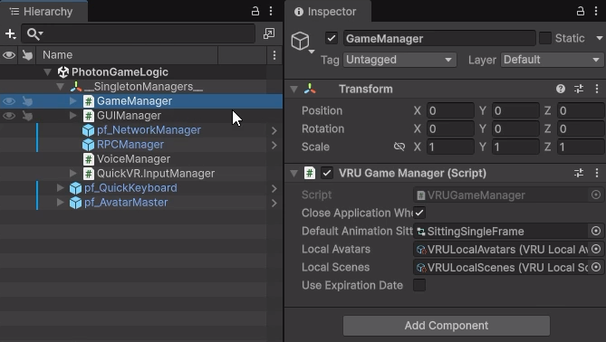
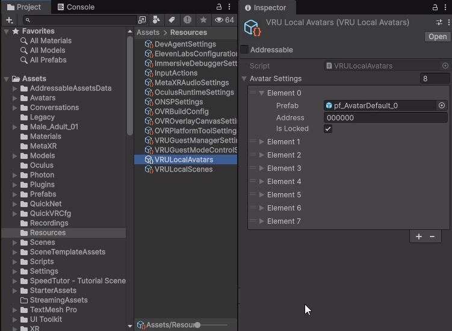
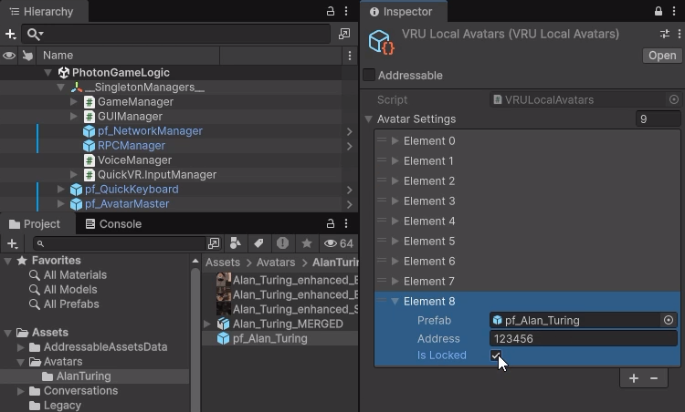
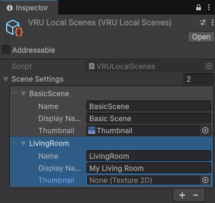
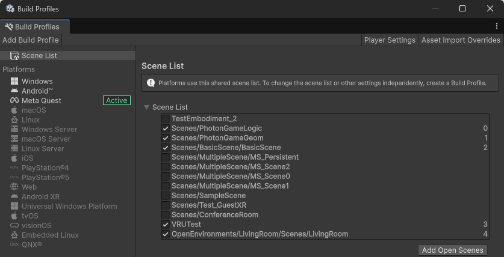
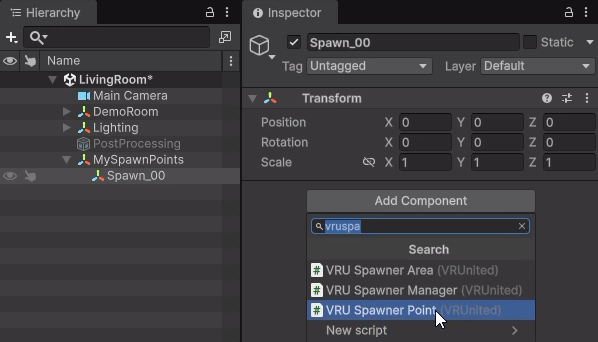
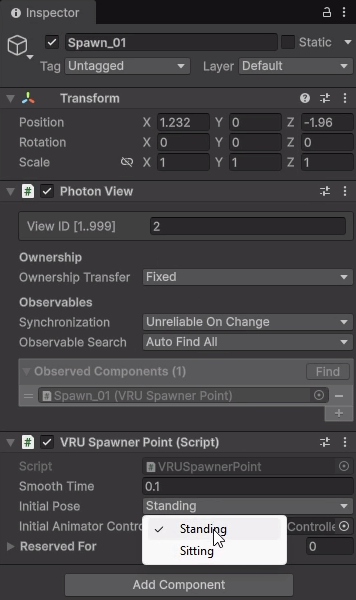
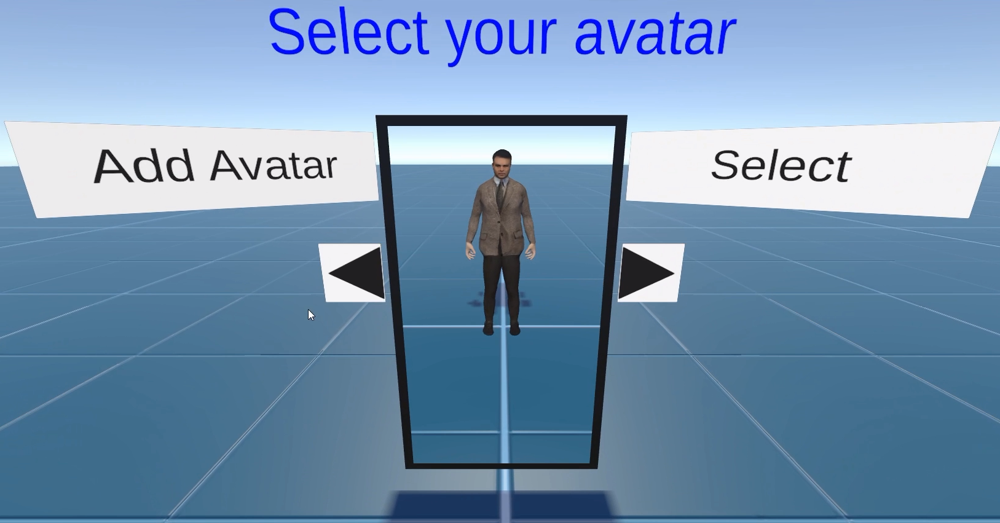
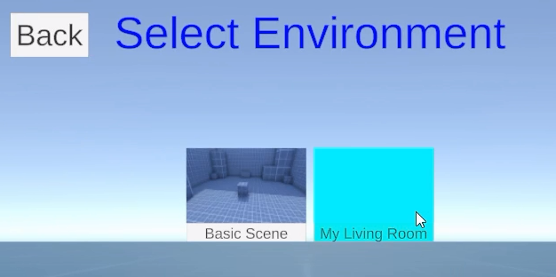
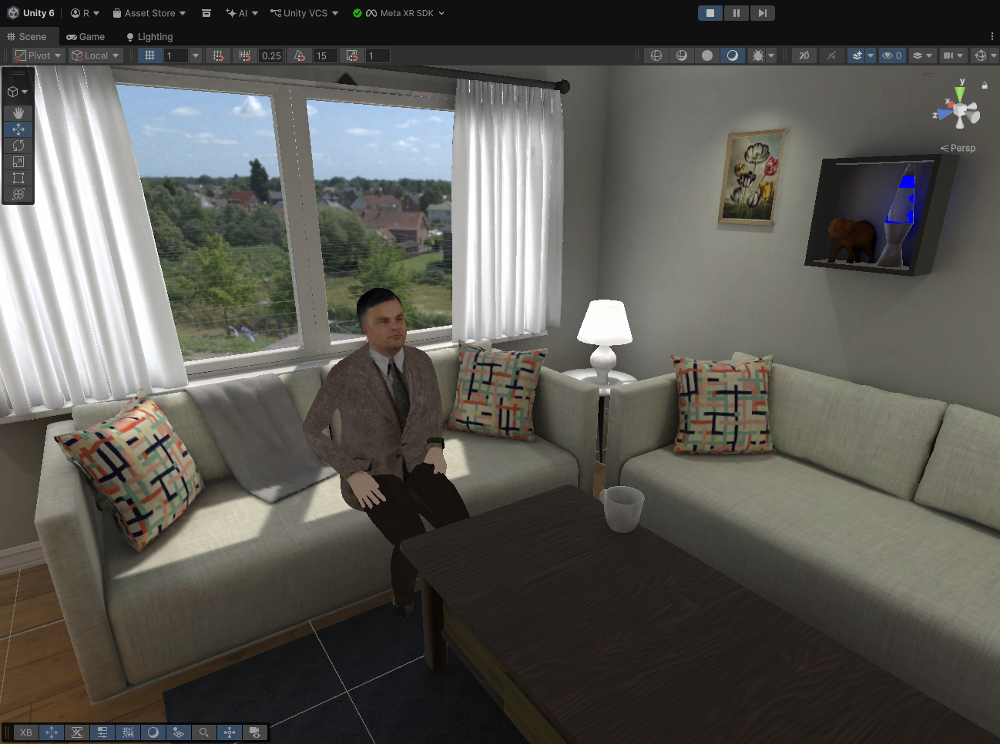

# Adding Local Assets

In this section, we will cover how to add custom avatars and scenarios locally to your VRUnited project. These assets will be included directly in your application build.

    <iframe src="https://www.youtube.com/embed/ZIANOexk_Z8" frameborder="0" allowfullscreen style="position: absolute; top: 0; left: 0; width: 100%; height: 100%;"></iframe>

## 1. Adding Local Avatars

* In the top menu, go to **Assets > Import Package > Custom Package...** and select your custom avatar package to import it into your project.
* A quick way to locate the `VRULocalAvatars` asset is to open the `PhotonGameLogic` scene (the initial scene containing the main VRUnited logic). In the Hierarchy, select the `GameManager` object located under `__SingletonManagers__`.

* In the Inspector for the `GameManager`, you will see attributes referencing both the local avatars and local scenes assets. Clicking on the local avatars attribute will automatically highlight and locate the `VRULocalAvatars` asset in your Project window.

* Select the `VRULocalAvatars` asset. In the Inspector, expand the Avatars list and increase its size to add a new element. Drag and drop your custom avatar prefab from the Project window into the new empty slot.
* **Configure Avatar Settings:** For the newly added avatar, you must configure two key properties:
    * **Address:** A unique alphanumeric identifier for this avatar. Ensure it does not match any existing avatar addresses. This code is used to unlock the avatar during the avatar selection phase.
    * **Is Locked:** A checkbox that indicates whether the avatar is locked by default. If it is locked, users must input the **Address** code in the avatar selection screen to unlock it. If it is unlocked (unchecked), the avatar is available to be selected right from the start without requiring any code.

## 2. Adding Local Scenes (Environments)

* Import your custom scene package using **Assets > Import Package > Custom Package...**.
* Similar to the avatars, you can quickly find the `VRULocalScenes` asset by selecting the `GameManager` in the `PhotonGameLogic` scene and clicking on the local scenes attribute in the Inspector.
* Select the `VRULocalScenes` asset. In the Inspector, expand the Scenes list and increase its size to create a new entry.
* Configure the **Scene Settings** properties for the new entry:
    * **Name:** This must exactly match the filename of your local scene.
    * **Display Name:** The descriptive name that will be shown during the environment selection phase. It does not need to match the filename.
    * **Thumbnail:** A representative image of the scene used for quick identification in the selection menu. This can be left empty and added later.

* Navigate to **File > Build Profiles**. Ensure your new scene is added to the **Scene List** by dragging it into the window or clicking **Add Open Scenes** while the scene is active.

## 3. Configuring Spawn Points

* Open your newly imported custom scene in the Unity Editor.
* In the Hierarchy, create an Empty GameObject (e.g., `MySpawnPoints`) to organize your spawn locations.
* Create another Empty GameObject as a child of the previous one (e.g., `Spawn_00`).
* Select `Spawn_00`, click **Add Component** in the Inspector, and search for the **VRU Spawnner Point** script to attach it.

* Use the Move Tool to position the `Spawn_00` object exactly where you want the player to appear within the room.
* Configure the **VRU Spawnner Point** attributes in the Inspector:
    * **Initial Pose:** Defines the starting pose of the avatar (e.g., whether they will appear sitting or standing).
    * **Reserved For:** A list containing the IDs (Addresses) of the avatars for which this spawn point is reserved. If the list is empty, any avatar can use this spawn point. If it contains one or more elements, only avatars with those matching Addresses can spawn here.

* Repeat this process (creating additional child objects like `Spawn_01`, `Spawn_02`, etc.) to define all the spawn points needed for the maximum number of players the scene supports. For example, if your scene is designed for up to 4 players, you must define 4 separate spawn points.

## 4. Testing Local Assets

* Press the **Play** button in the Unity Editor to test the project.
* Select either **Multiplayer** or **Solo** mode from the starting menu. Choose Multiplayer if you want to test the scene and multiple spawn points with other users, or Solo if you want to explore the environment by yourself without other players.
* In the Avatar Selection screen, you will stand in front of a mirror reflecting your currently selected avatar. If you are using a VR headset, you are embodied in this avatar and can move your virtual body using your physical movements and VR controllers.
* Use the arrows next to the mirror to cycle through your unlocked avatars. If the avatar you want to test is locked, click the **Add Avatar** button and input its unique ID (Address). It will immediately become available for selection.

* Once you are happy with your choice, click the **Select** button to confirm your avatar and proceed to the next phase.
* Click on **Create Room** to begin setting up your virtual space.
* On the Environment Selection screen, look for your new custom scene, ensure it appears with its assigned thumbnail, and select it.

* Finally, enter a name for your room (e.g., "Test") and complete the creation process. 
* You will load into the room. Confirm that your avatar spawns correctly at the designated spawn point and with the correct initial pose.

