# VRUnited Template Setup Guide

Follow these steps to download, configure, and build your custom VRUnited project.

## 1. Download VRUnited Template

1. Navigate to the desired directory on your computer where you want to clone the project (create the directory if it does not exist yet).
2. Clone the repository using the command line or your preferred Git client (e.g., TortoiseGit). You can clone the project using either of the following methods:
   * **SSH:** `git@gitlab.com:vrunited/VRUnited-Main.git`
   * **HTTPS:** `https://gitlab.com/vrunited/VRUMain.git`

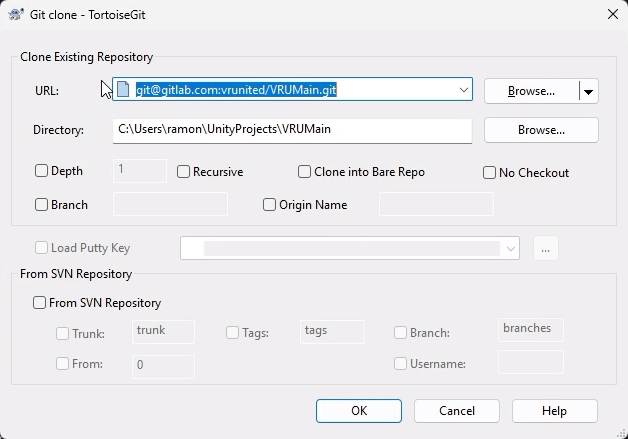

## 2. Open Project in Unity

* Open **Unity Hub**, click **Add**, and locate your newly cloned project folder to open it. The template currently runs on **Unity 6000.0.4f1**.

> **Note:** Depending on your specific Unity version, plugin updates, or previous configurations, you may or may not see the following prompts when the editor loads. If they appear, follow the instructions below. If they do not appear, it is not a blocking issue—simply proceed to the next section.

* If a prompt appears asking to **"Enable Meta XR Features"**, click **Yes**.

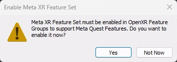

* If the **Project Setup Tool** window opens showing recommended fixes, click **Fix All** in the bottom right corner to automatically resolve missing configuration settings.

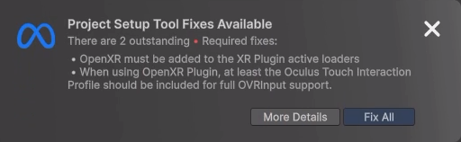

## 3. Configure Photon (PUN & Voice)

* In Unity, navigate to the top menu and select **Window > Photon Unity Networking > PUN Wizard**, then click **Highlight Server Settings**.

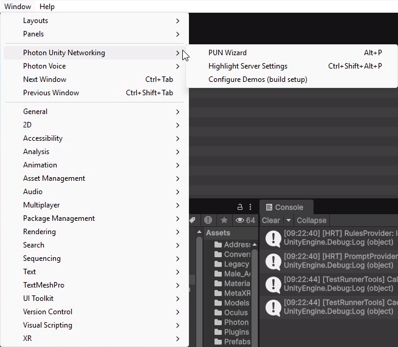

* This will highlight the `PhotonServerSettings` asset in your project, which is used internally by Photon to configure the application.
* Select this file to view its properties in the Inspector. In the **Server/Cloud Settings** section, you will find the **App Id PUN** and **App Id Voice** fields. These IDs basically identify the multiplayer and voice projects within the Photon servers to synchronize the virtual world and voice transmission.

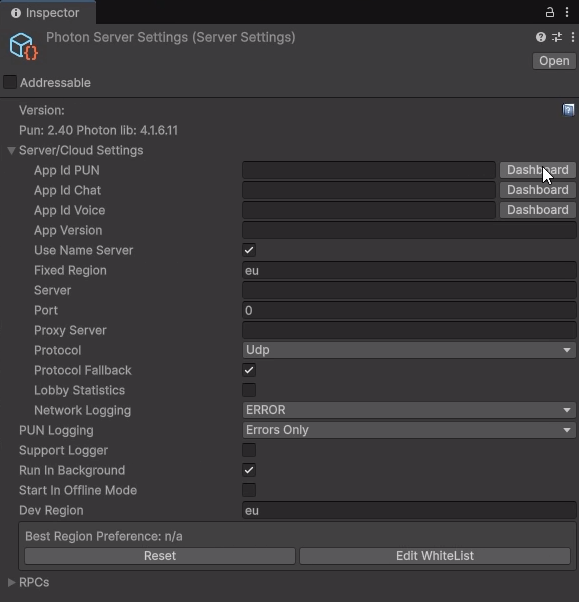

* Click the **Dashboard** button next to any of the App Id fields. This will automatically open your web browser and take you to your Photon dashboard.

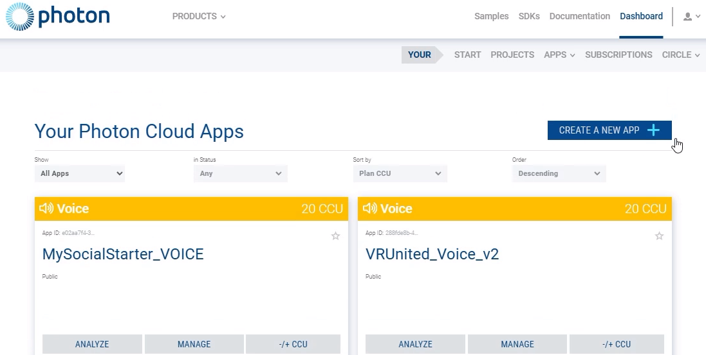

* **Create the PUN App:** Click **Create a New App**, set the Photon SDK to **Pun**, enter an Application Name (e.g., `MyVRUnitedProject`), and click **Create**.
* **Create the Voice App:** Click **Create a New App** again, set the Photon SDK to **Voice**, enter an Application Name (e.g., `MyVRUnitedProject_Voice`), and click **Create**.
* From your dashboard, copy the **App ID** of your new PUN application and paste it into the **App Id PUN** field within Unity's `PhotonServerSettings` inspector.
* Repeat the process to get the **App ID** of the Voice application, and enter this ID into the **App Id Voice** field in the `PhotonServerSettings` inspector.

## 4. Check VR Configuration
* Go to **Edit > Project Settings** and select **XR Plug-in Management** from the left sidebar.
* Under the **Android** tab, ensure that the **OpenXR** plug-in provider is checked. Ensure that the **OpenXR** plug-in provider is also checked under the **Desktop** tab.

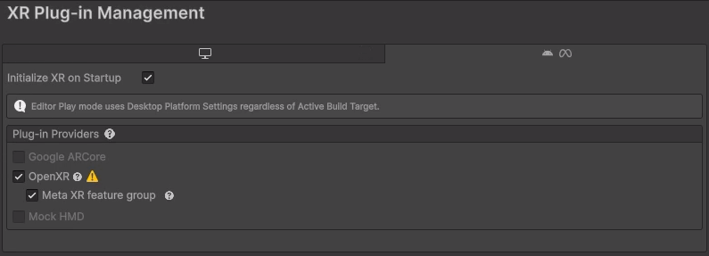

* Click on **OpenXR** under the XR Plug-in Management dropdown. Under the **Desktop** tab, add any interaction profiles you need to support for your specific case (Meta Quest, HTC Vive, Valve Index, etc.).
* In the **OpenXR Feature Groups** section, ensure that the following options are enabled (checked): **Get System Info**, **Hand Tracking Subsystem**, and **Meta Hand Tracking Aim**.
* Similarly, configure the **Android** platform. Ensure that in the **Interaction Profiles** section, you have added all the controller types that your application will support.
* In the **OpenXR Feature Groups** section for the Android platform, ensure that you select **Hand Tracking Subsystem** and **Meta Hand Tracking Aim**.

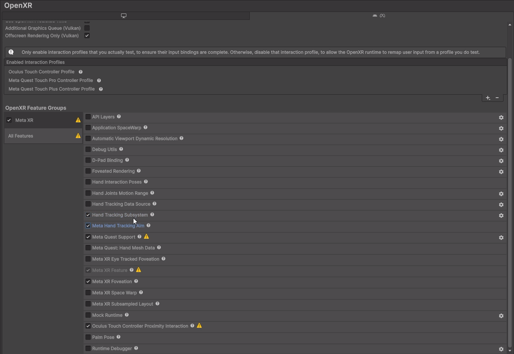

## 5. Switch Profile and Update Player Settings
* Navigate to **File > Build Profiles**.
* Select the **Meta Quest** profile from the list and click **Switch Platform**. Wait for Unity to recompile the scripts and compress assets.

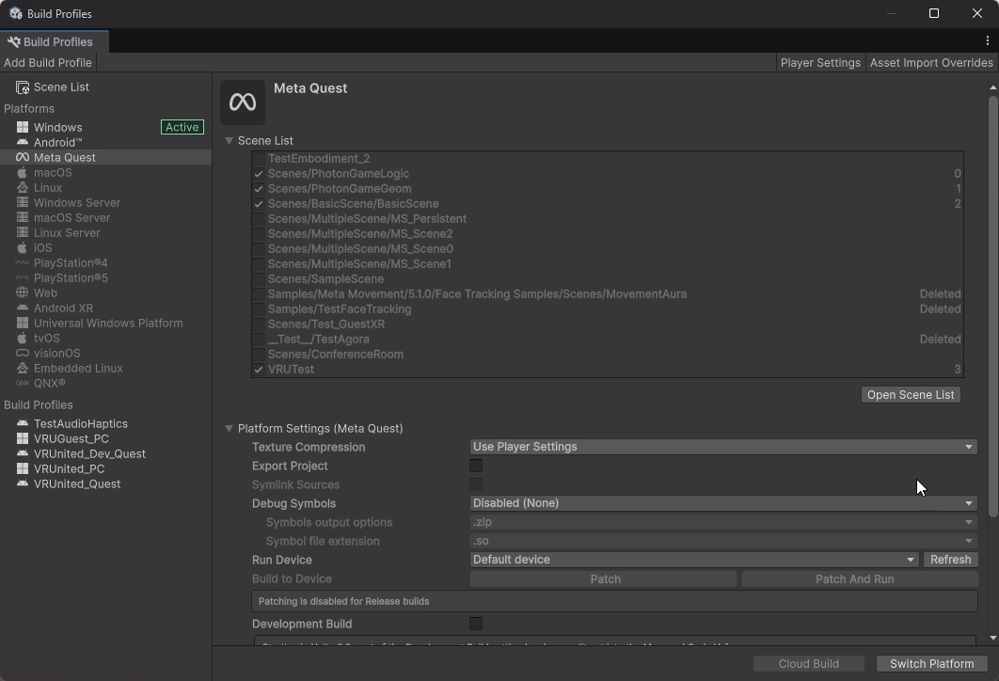

* Go to **Edit > Project Settings** and select **Player**.
* Update the **Company Name** and **Product Name** to match your specific project details.

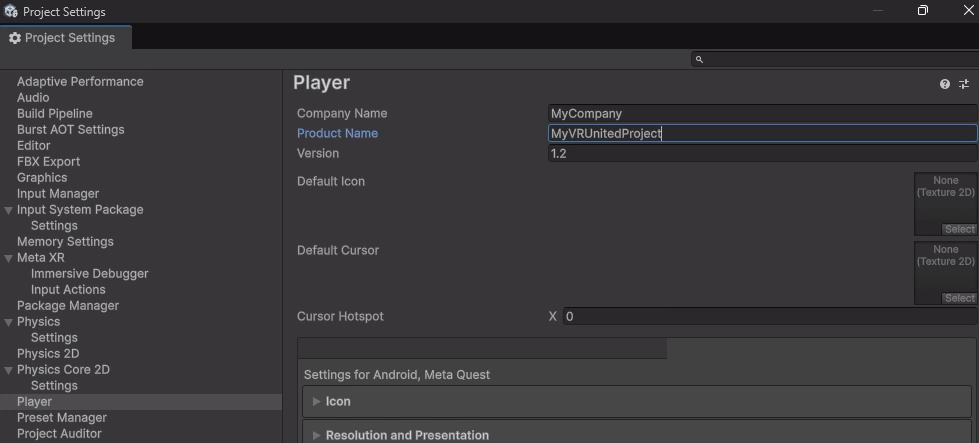

* Scroll down to **Publishing Settings** and check the **Keystore Manager**. Select your custom keystore file and enter the required **Keystore password** and **Key password**.

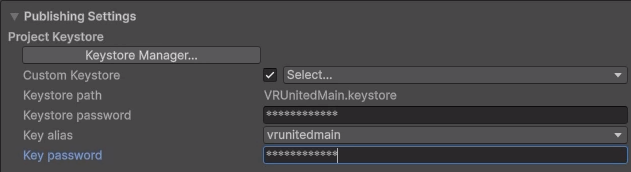

* In the Project window, use the search bar to find the `AndroidManifest` file. It is located in `Assets > Plugins > Android`.
* Open the file with your default code editor and, on the second line, change the `package` name to match the company and product name you defined previously.

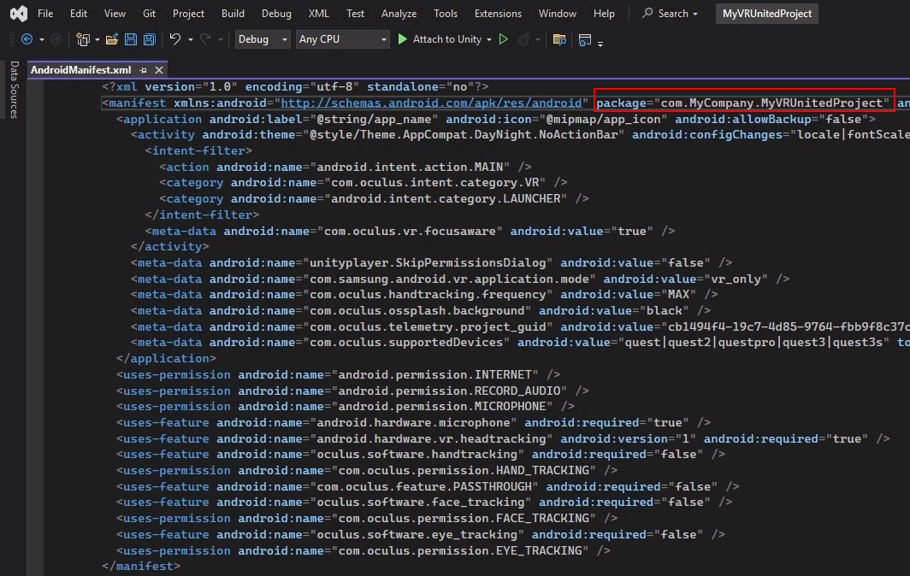

## 6. Build the Project
* Return to **File > Build Profiles**. Click **Build**.

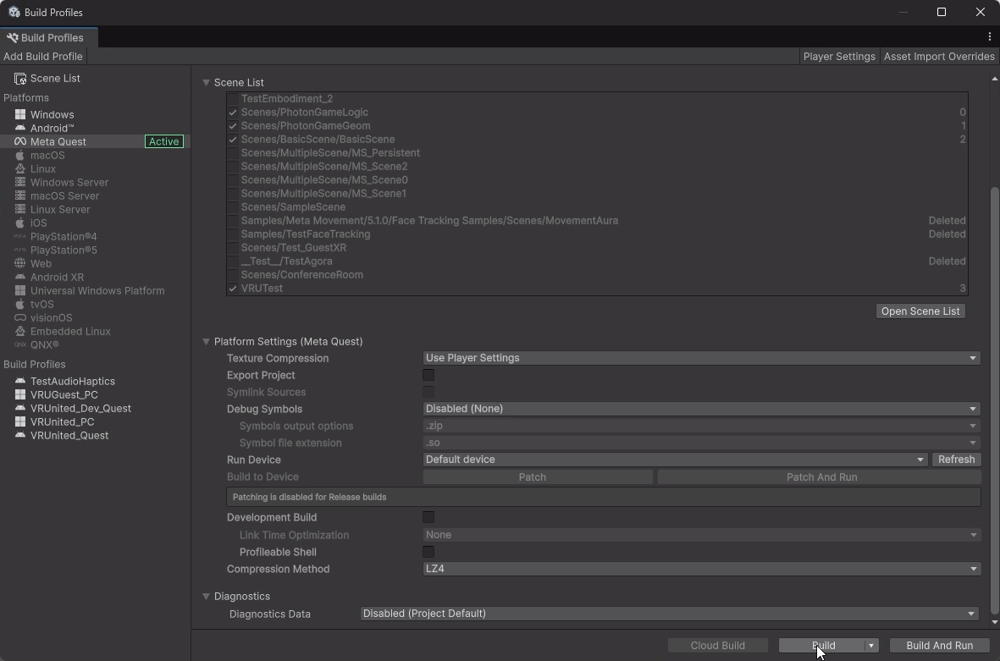

* Select the location where you want to generate the build. (Note: Creating a specific `Builds` folder inside your project directory is highly recommended to keep things organized, but you can save it anywhere you prefer).
* Name your file (e.g., `MyVRUnitedProject.apk`) and click **Save**.
* If a warning prompt appears stating "Missing Project ID", click **Yes** to continue.

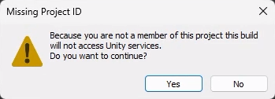

* Wait for the build process to complete. Your APK is now ready to be deployed to your headset.